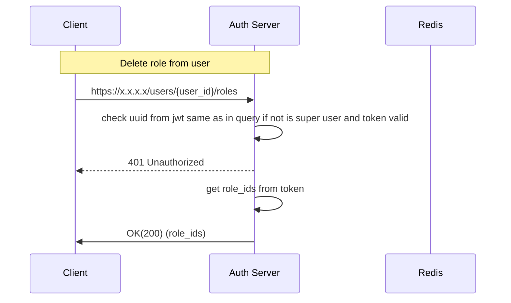

```mermaid
sequenceDiagram
    participant C as Client  
    participant S as Auth Server
    participant R as Redis

	Note over C, S: Delete role from user
	C->>S: https://x.x.x.x/users/{user_id}/roles
	S->>S: check uuid from jwt same as in query if not is super user and token valid
	S-->>C: 401 Unauthorized
	S->>S: get role_ids from token
	S->>C: OK(200) (role_ids)

```

**Path**: /users/{user_uuid}/roles

**Type**: GET
**Header**: Authorization: Bearer {token}  
**Body**: None
**Response Body**: 
```
{  
	"user_id": "",
	"role_id": [1,2,3]
}  
```
