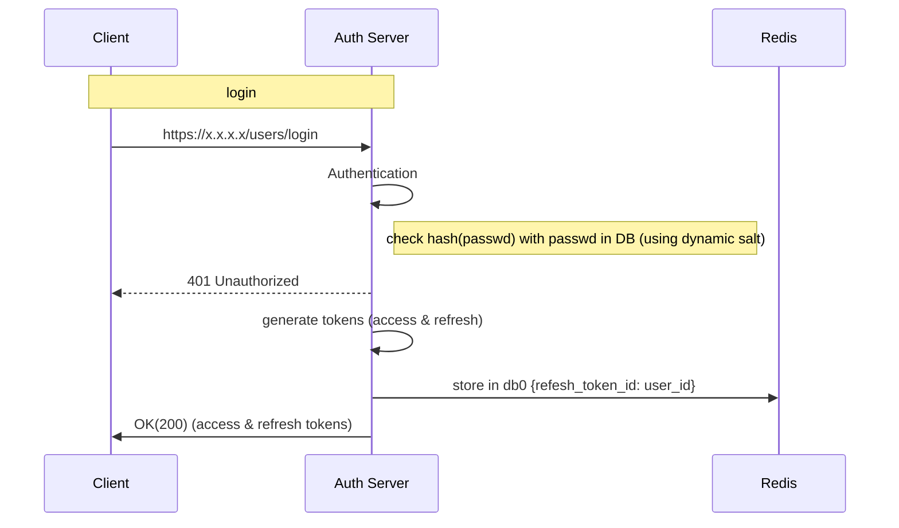

**Path**: /users/login
**Type**: Post  
**Body**:  
```
{
	"login": "",
	"password": ""
}  
```
**Response Body**:  
```
{
	"access_token": "access_token",
	"refresh_token": "refresh_token"
}  
```
Token time to live 1 day
Token refresh time to live 10 days
