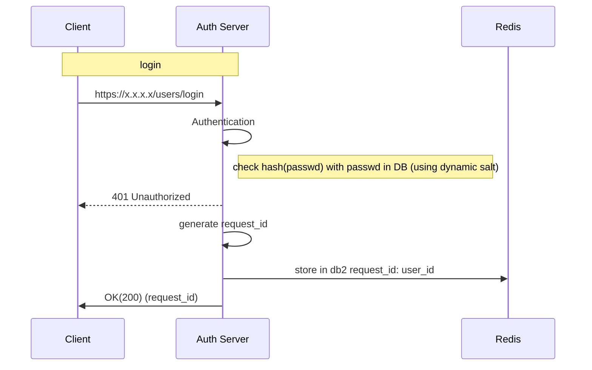

```mermaid
sequenceDiagram
    participant C as Client  
    participant S as Auth Server
    participant R as Redis

	Note over C, S: login
	C->>S: https://x.x.x.x/users/login
	S->>S: Authentication
	Note right of S: check hash(passwd) with passwd in DB (using dynamic salt)
	S-->>C: 401 Unauthorized
	S->>S: generate request_id
	S->>R: store in db2 request_id: user_id
	S->>C: OK(200) (request_id)
```

**Path**: /users/login
**Type**: Post  
**Body**:  
```
{
	"login": "",
	"password": ""
}  
```
**Response Body**:  
```
{
	"request_id": "",
}  
```
