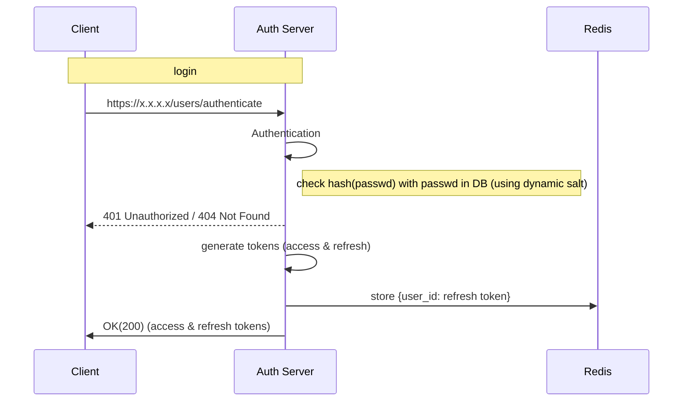

**Path**: /users/authenticate
**Type**: Post
**Body**:
{
	login: "",
	password: ""
}
**Response Body**:
{
access_id: access_token,
refresh_id: refresh_token
}

Token time to live 1 day
Token refresh time to live 10 days