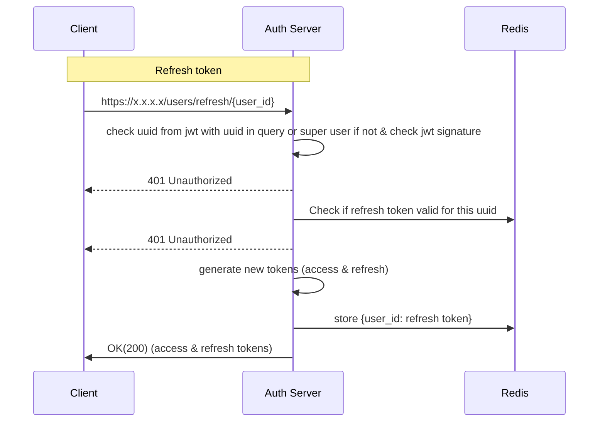

**Path**: /users/refresh/{user_id}  

**Type**: Get  
**Header**: Authorization: Bearer {token}  
**Body**: None  
**Response Body**:  
{  
access_id: access_token,
refresh_id: refresh_token
}  

Token time to live 1 day
Token refresh time to live 10 days
