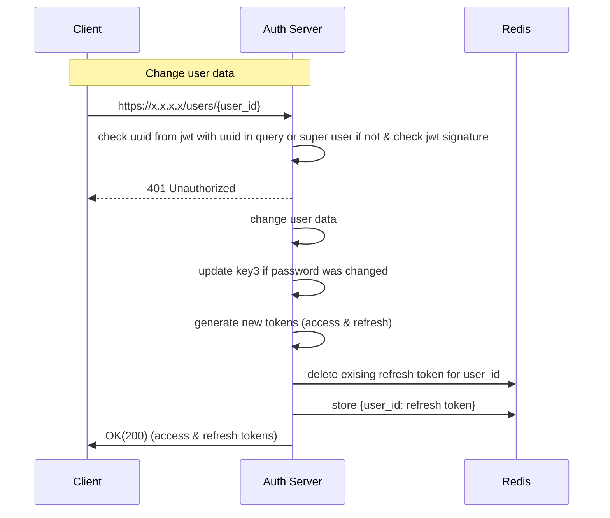

**Path**: /users/{user_id}  
**Type**: PUT  
**Header**: Authorization: Bearer {token}  
**Body**:   
{
	first_name: "",
	last_name: "",
	login: "",
	password: ""
}  
**Response Body**:  
{
access_id: access_token,
refresh_id: refresh_token
}  

Token time to live 1 day
Token refresh time to live 10 days
