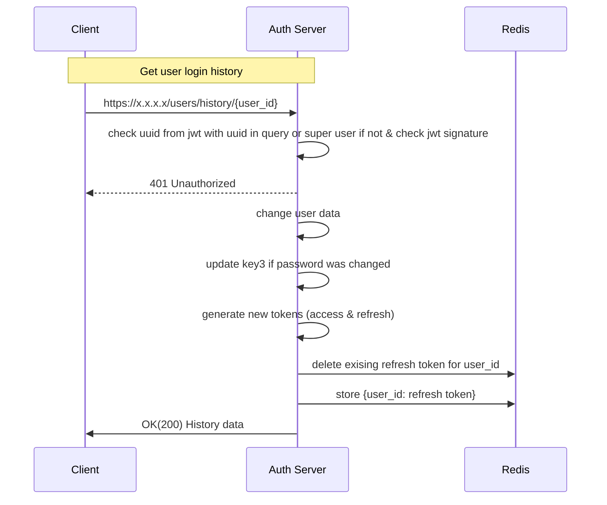

**Path**: /users/history/{user_id}?per_pagenum=x&page_num=y

**Type**: GET
**Header**: Authorization: Bearer {token}
**Body**: None
**Response Body**:
{
user_agent: "",
login_date: "",
login_status: ""
}