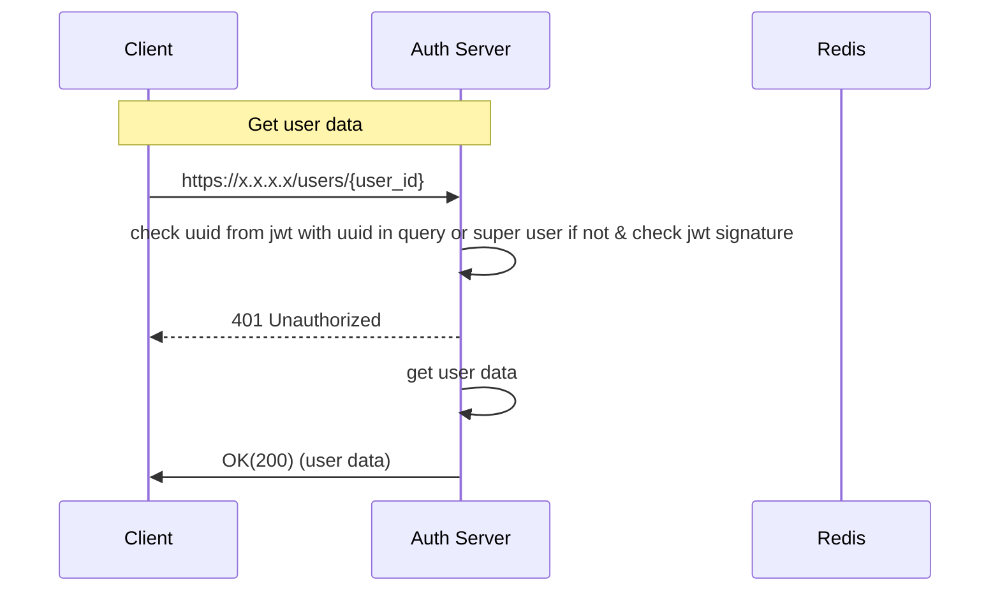

**Path**: /users/{user_id} 

**Type**: Get  
**Header**: Authorization: Bearer {token}  
**Body**: None  
**Response Body**:  
```
{
	"first_name": "",
	"last_name": ""
}  
```

Token time to live 1 day
Token refresh time to live 10 days