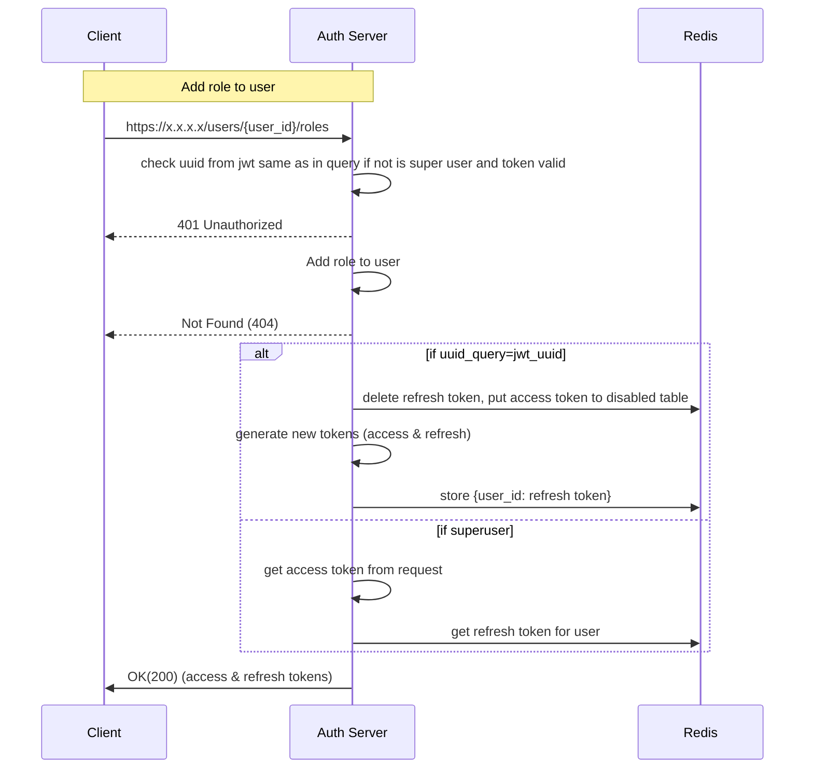

**Path**: /users/{user_uuid}/roles

**Type**: POST
**Header**: Authorization: Bearer {token}  
**Body**: 
```
{
	"role_id": [1,2,3]
}
```
**Response Body**: 
```
{  
	"access_id": "access_token",
	"refresh_id": "refresh_token"
}  
```

Token time to live 1 day
Token refresh time to live 10 days

If superuser add role to user - user will get new role only after token refresh (mainly after expire time)