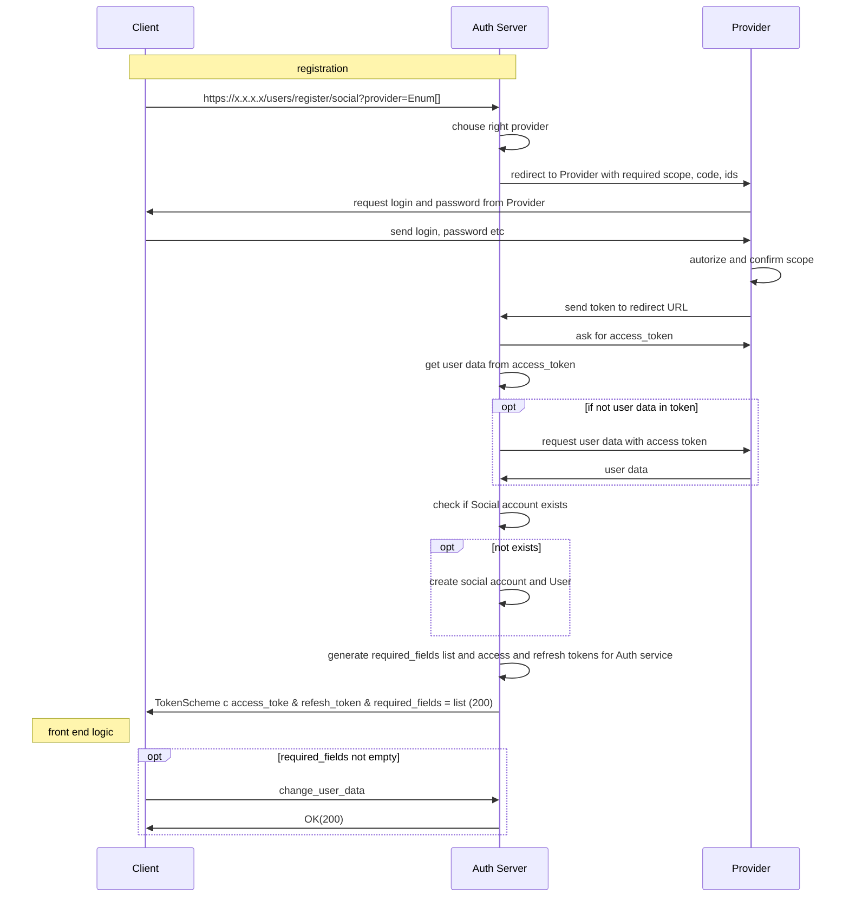

**Path**: /users/register/social?provider=Enum[]  
**Type**: Get  
**Body**: None  
**Response Body**
```
{
	"access_token": "access_token",
	"refresh_token": "refresh_token",
	"required_fields": list() #optional
}
```